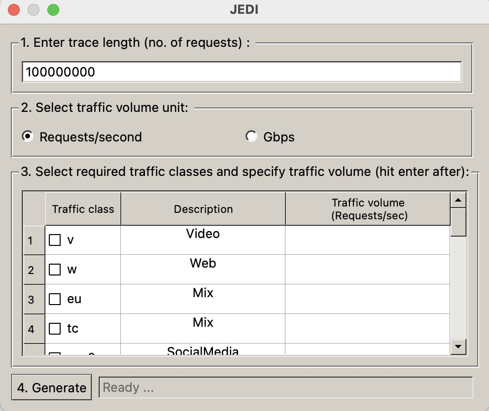

## JEDI

JEDI is an extension of our prior tool [TRAGEN](https://groups.cs.umass.edu/ramesh/wp-content/uploads/sites/3/2021/10/imc2021-final270.pdf). JEDI produces synthetic traces that have similar caching properties and object-level properties as original production traces. The original trace and the synthetic trace will have the same hitrates in a cache simulation for a wide range of cache algorithms. JEDI is seeded with realistic populaity-size footprint descriptor (pFD) models computed using original traces from Akamai's production CDNs. The pFD models extend from the Footprint Descriptor models described in [[1]](#1). The pFD models capture the caching properties and object-level properties of the original traces. Using pFDs, JEDI produces a synthetic trace that fits the model. 

Some pre-generated synthetic traces generated by the tool can be directly downloaded for use [Pre-generated Synthetic Traces](#3-downloadable-synthetic-traces-produced-by-jedi).

The new traces i.e., the traces generated from traffic models computed from 2025 will also capture the diurnal request rate of the traces. The request rate is computed in 5 minute intervals and saved in the file request_rate.txt, for example, FOOTPRINT_DESCRIPTORS/w-1/request-rate.txt. The generated synthetic trace will have timestamps that match the request rate from the production trace.

More detailed information about JEDI can be found in the [paper at this link](https://groups.cs.umass.edu/ramesh/wp-content/uploads/sites/3/2022/11/JEDI.pdf). Please use the full citation information below when using JEDI in your work.

[JEDI: model-driven trace generation for cache simulations](https://groups.cs.umass.edu/ramesh/wp-content/uploads/sites/3/2022/11/JEDI.pdf), by Anirudh Sabnis and Ramesh K. Sitaraman, ACM Internet Measurement Conference (IMC), October 2022.

The github link for our prior work can be found in [TRAGEN](https://github.com/UMass-LIDS/Tragen) [[2]](#2). 

## 1. Installation

1. Install [python3](https://www.python.org/downloads/).

2. Install the following packages - numpy, scipy, pyQt5 and datetime.
   * ``` pip3 install numpy scipy pyQt5 datetime matplotlib pathos```

## 2. Use JEDI to generate synthetic traces

User can select a traffic model from the [available traffic models](#6-available-traffic-models) to produce a synthetic trace that fits the model.

1. Select a model that is described as *Mix* to generate a synthetic trace that is representative of the original trace obtained from a server that is serving a mix of traffic classes. 

2. Or, select multiple traffic models and provide the required traffic volumes for each selected option to create a custom traffic mix. For e.g., 10GBps of traffic from Amazon mixed with 5GBps of traffic from Microsoft.

The user can use a [Command Line Interface](#21-command-line-interface) or the [GUI](#22-GUI).

### 2.1. Command line interface

Run the following command in the home directory of TRAGEN to operate in the CLI mode.
   * ``` python3 tragen_cli.py -c <config_file> ```

#### 2.2.1. Config file

The config file is to be in the json format. An example of a config file is:

```json
{
    "Trace_length": "100000000",
    "Input_unit"  : "reqs/s",
    "Traffic_classes" : [
        {
            "traffic_class": "v",
            "traffic_volume": "1000"
        },
        {
            "traffic_class":"w",
            "traffic_volume":"2000"
        }
    ]
}
```

1. **Trace_length**. Specify the number of requests in the synthetic trace.
2. **Input_unit**. Enter the unit with which the traffic volume for each traffic class will be specified - reqs/s or GBps.
3. **Traffic_classes**. Create a custom traffic mix by providing a list of traffic classes and their respective traffic volumes. 
   * traffic_class should be one of the traffic classes specified in the [available traffic models](#6-available-traffic-models).
   * traffic_volume field specifies the traffic volume for the traffic class.

The produced synthetic trace is in a directory that is not surprisingly called ./OUTPUT.

### 2.2. GUI

I hope you use the Command Line Interface. Run the following command in the home directory of TRAGEN to display the GUI.
   * ``` python3 tragen_gui.py ```

Below is a screenshot of the GUI. 



1. **Enter trace length**. Specify the number of requests in the synthetic trace.
2. **Select traffic volume unit**. Select if the traffic volume field in the third column of the table will be input as requests/second or Gigabits per second (Gbps).
3. **Select required traffic classes and specify the traffic volume**. Select traffic classes from the first column of the table and specify a traffic volume for the selected traffic classes in the third column of the table. The second column provides a description of each choice. Each choice is either a pure traffic class  such as video, web, or social media traffic class. Or, it is a traffic mix itself.
4. **Generate**. Hit the generate button and TRAGEN will start producing the synthetic trace.

#### 2.2.2. Output

The produced synthetic trace is found in the directory ./OUTPUT/

## 3. Downloadable synthetic traces produced by Jedi

Below are some synthetic traces generated by the tool and you can use these for your experiments. For a more complicated case, please use the tool.

V: Traffic collected from servers predominantly serving video traffic [download link](https://drive.google.com/file/d/1BU42aNOOLloWEMUHulZebqIrRUNvS6t4/view?usp=sharing).

W: Traffic collected from servers predominantly serving web traffic [download link](https://drive.google.com/file/d/1_gbMhJXU93PCXyFz_MOIS76hwDpfmiZv/view?usp=sharing).

TC: Traffic collected from a cluster of servers serving a mix of traffic [download link](https://drive.google.com/file/d/1r8wBI3QJAiebmQ8Py_JOqkKv15OqMCrn/view?usp=sharing).

EU: Traffic collected from a cluster of servers serving a mix of traffic [download link](https://drive.google.com/file/d/1Kp6hQK0Zk-KdEvyU3W0XF0XbVxI-poM6/view?usp=sharing).

TC-0: Subset of tc trace that corresponds to downloads [download link](https://drive.google.com/file/d/1tprv6XSoUQbYtkFSP66l5z3X0dHiAwCS/view?usp=sharing).

TC-1: Subset of tc trace that corresponds to images [download link](https://drive.google.com/file/d/1_cn1jRXHyVQnDMcz-xZ_Y8WqFyDWlT6a/view?usp=sharing).

TC-2: Subset of tc trace that corresponds to media [download link](https://drive.google.com/file/d/1laOmQyC50fe3-rISCn1Jglg0y3-dPoZ7/view?usp=sharing).

TC-3: Subset of tc trace that corresponds to web [download link](https://drive.google.com/file/d/1laOmQyC50fe3-rISCn1Jglg0y3-dPoZ7/view?usp=sharing).

EU-5: Subset of eu trace corresponding to social media traffic [download link](https://drive.google.com/file/d/1RTLq7TixHcRt07dHpau9curIUDgq3byr/view?usp=sharing).

EU-7: Subset of eu trace corresponding to web traffic [download link](https://drive.google.com/file/d/15k0WvCysT6ZLaEvWCkD8cEFpdQOFwdQ3/view?usp=sharing).


## 4. Generate and submit traffic models

#### 4.1 Generate traffic models

A traffic model is a five-tuple consisting of a popularity-size footprint descriptor. To generate traffic models for your own original traces provide the original trace in a file in the following format. Each request in the trace is comma seperated list of timestamp, object_id, and object_size (in KB). Now, each request is on a new line. For example,

```
timestamp, object_id, object_size (KB)
1532702631,0,26624
1532702631,1,12288
1532702631,2,26624
1532702631,3,26624
	.
	.
	.
	.
```

Use the following command,
   * ``` python3 popularity_traffic_modeler.py <path_to_original_trace> <output_dir>```
   
The output_dir contains the popularity-size footprint descriptor (pfd.txt) and a joint popularity-size distribution (popularity_sz.txt). Please note that in order to run successfully, the script requires that the total size of all the objects in the trace is at least 10 MB. If not, please edit line 117 of the popularity_traffic_modeler.py appropriately.

#### 4.2. Submitting traffic models

Consider adding your footprint descriptors to our repository. To do so,

1. Create a directory FOOTPRINT_DESCRIPTOR/<your_traffic_class_name>.
2. Copy the footprint descriptor (named as pfd.txt.gz, gzip it) and joint popularity-size distribution (popularity_sz.txt) to FOOTPRINT_DESCRIPTOR/<your_traffic_class_name>/.
3. Create an entry in [available traffic models](#6-available-traffic-models).
4. Update the file FOOTPRINT_DESCRIPTOR/available_fds.txt

## 5. Developer mode

We welcome users to suggest modifications to improve the quality of the code or add new features to the existing codebase. Use the developer branch to make edits and submit a change.

## 6. Available traffic models

The currently available traffic models are:

| |Traffic class|                        Description| Traffic type|Year Collected| Diurnal request rate|
|:-|:-:|:-------------------------------------------------------------|:--:|:--:|:--:|
|1|V|Traffic collected from servers predominantly serving video traffic|Video|2018|No|
|2|W|Traffic collected from servers predominantly serving web traffic|Web|2015|No|
|3|EU|Traffic collected from a cluster of servers serving a mix of traffic|Mix|2015|No|
|4|TC|Traffic collected from a cluster of servers serving a mix of traffic|Mix|2018|No|
|5|EU-0|Subset of eu trace corresponding to media traffic|SocialMedia|2015|No|
|6|EU-1|Subset of eu trace corresponding to media traffic|SocialMedia|2015|No|
|7|EU-2|Subset of eu trace corresponding to media traffic|SocialMedia|2015|No|
|8|EU-3|Subset of eu trace corresponding to media traffic|SocialMedia|2015|No|
|9|EU-4|Subset of eu trace corresponding to media traffic|SocialMedia|2015|No|
|10|EU-5|Subset of eu trace corresponding to media traffic|SocialMedia|2015|No|
|11|EU-6|Subset of eu trace corresponding to media traffic|SocialMedia|2015|No|
|12|EU-7|Subset of eu trace corresponding to media traffic|Web|2015|No|
|13|EU-8|Subset of eu trace corresponding to media traffic|SocialMedia|2015|No|
|14|EU-9|Subset of eu trace corresponding to media traffic|Web|2015|No|
|15|TC-0|Subset of tc trace that corresponds to downloads|Download|2015|No|
|15|TC-1|Subset of tc trace that corresponds to images|Images|2015|No|
|16|TC-2|Subset of tc trace that corresponds to media|Media|2015|No|
|17|TC-3|Subset of tc trace that corresponds to web|Web|2015|No|
|17|TC-3|Subset of tc trace that corresponds to web|Web|2015|No|
|18|V-1|Traffic collected from servers in a major US metro predominantly serving video traffic|Video|2025|Yes|
|19|V-2|Traffic collected from servers in a major EU metro predominantly serving video traffic|Video|2025|Yes|
|20|W-1|Traffic collected from servers in a major US metro predominantly serving web traffic|Web|2025|Yes|
|21|W-2|Traffic collected from servers in a major EU metro predominantly serving web traffic|Web|2025|Yes|
|22|D-1|Traffic collected from servers in a major US metro predominantly serving download traffic|Download|2025|Yes|
|23|D-2|Traffic collected from servers in a major EU metro predominantly serving download traffic|Download|2025|Yes|


## 7. References

<a id="1">[1]</a> 
Sundarrajan, Aditya, Mingdong Feng, Mangesh Kasbekar, and Ramesh K. Sitaraman. "[Footprint descriptors: Theory and practice of cache provisioning in a global cdn](https://groups.cs.umass.edu/ramesh/wp-content/uploads/sites/3/2019/12/Footprint-Descriptors-Theory-and-Practice-of-Cache-Provisioning-in-a-Global-CDN.pdf)." In Proceedings of the 13th International Conference on emerging Networking EXperiments and Technologies, pp. 55-67. 2017.

<a id="1">[2]</a> 
Anirudh Sabnis, Ramesh K. Sitaraman. "[TRAGEN: A Synthetic Trace Generator for Realistic Cache Simulations](https://groups.cs.umass.edu/ramesh/wp-content/uploads/sites/3/2019/12/Footprint-Descriptors-Theory-and-Practice-of-Cache-Provisioning-in-a-Global-CDN.pdf)." In Proceedings of the 21st ACM Internet Measurement ConferenceNovember 2021 Pages 366–379.

## 8. Acknowledgements
This work was supported in part by NSF grants CNS-1763617, CNS-1901137, and CNS-2106463.

